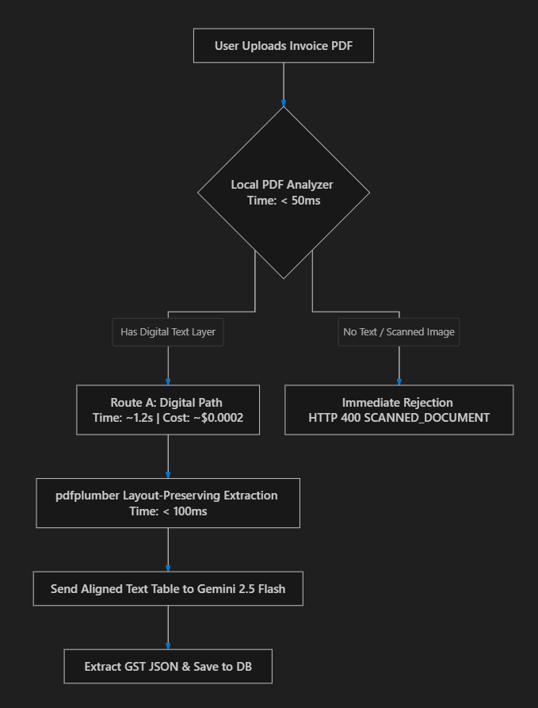
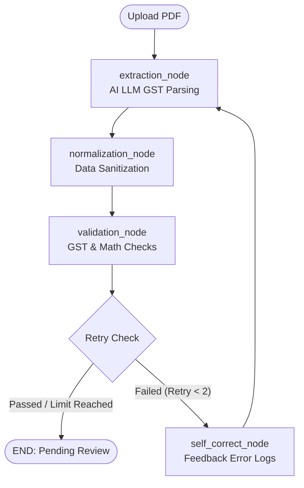
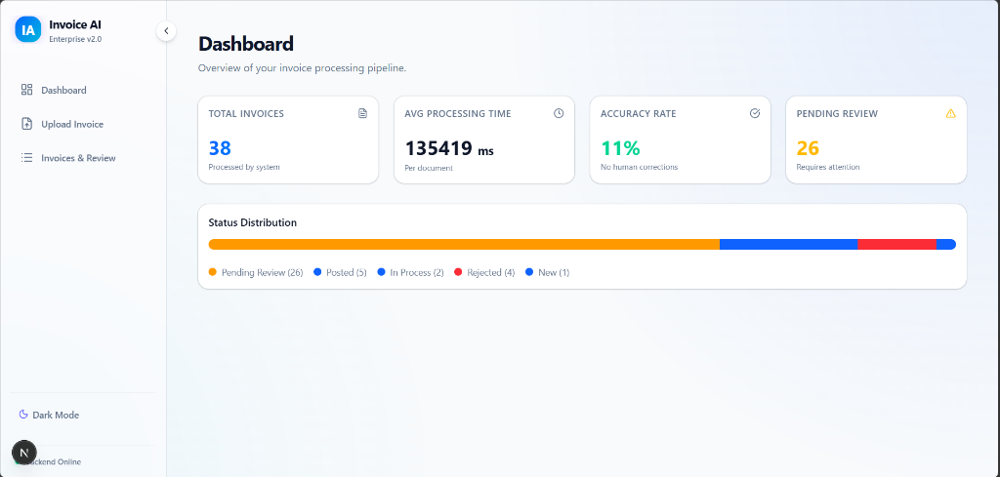
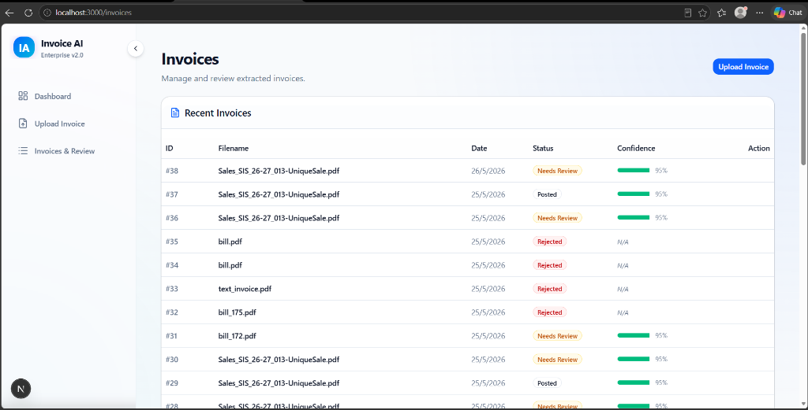

# Intelligent B2B GST Invoice Automation & ERP Integration Platform

An enterprise-grade, AI-powered document intelligence platform designed to ingest, parse, normalize, validate, and synchronize Indian B2B GST invoices with downstream ERP systems. 

This platform replaces slow, manual data entry with an **Agentic Self-Healing Extraction Pipeline** (powered by LangGraph and Gemini 2.5 Flash), a **GST Tax Compliance Engine**, and native integration adapters for **Tally Prime** (via compatible XML streams) and **ERPNext** (via REST APIs).

---

## 📐 Architecture & System Flow

### 1. Document Ingestion Pipeline
The diagram below illustrates the high-level document ingestion, spatial layout-preserving text extraction, scanned document routing, and LLM-driven agent extraction flow:



### 2. LangGraph Agentic Flow State Machine
Your structured B2B GST extraction is orchestrated via a cyclic state machine built on **LangGraph**. The pipeline handles autonomous Gemini 2.5 Flash parsing, post-extraction normalization, multi-layered business validation, and a self-healing correction loop:



---

## 🚀 Key Architectural Features

### 1. LangGraph-Driven Agentic Pipeline & Self-Correction
* **Format-Adaptive LLM Processing:** Leverages `Gemini 2.5 Flash` with structural prompts to parse complex Indian invoice layouts (dynamic line items, diverse discounts, reverse charge declarations, and multi-state addresses).
* **Self-Healing Loop:** Constructed an agentic state graph via `LangGraph`. If post-extraction validation checks find mathematical or structural errors, the pipeline automatically routes the document back to the extraction node, feeding the exact error logs into the LLM context for real-time retry correction (capped at 2 iterations).

### 2. Spatial Layout & Scanned Document Classification
* **Layout Preservation:** Utilizes `pdfplumber` to extract character-mapped spatial coordinates, preserving columnar alignment for accurate tabular line-item parsing.
* **Deterministic Classification Heuristics:** Employs a high-speed pre-extraction check to distinguish native digital PDFs from scanned images. If single-image page coverage exceeds **80%** or character density falls below safety margins, the system automatically rejects the upload as a scanned document.

### 3. GST Validation & Evidence-Based Confidence Engine
* **Business-Rule Validation:** Enforces strict Indian GST compliance: CGST/SGST ledger pairing equality, inter-state IGST routing validation, correct state-code extraction from 15-character GSTINs, and HSN/SAC code format checks.
* **Evidence-Based Confidence Scorer:** Rejects the LLM's own self-reported confidence guesses. Instead, a custom scoring engine dynamically compiles weighted metrics from mandatory field presence, line-item mathematical consistency (taxable amount + tax = total), and database matching.

### 4. Dual ERP Sync Engines (Tally & ERPNext)
* **Tally Prime XML Exporter:** Streams in-memory, Tally-compatible Sales Voucher XML structured in Tally's `ENVELOPE` schema, complete with stock items, ledger descriptions, and multi-tax ledger accounting.
* **ERPNext REST Client:** Programmed a robust Frappe REST client that connects to your ERPNext instance. To prevent database reference errors, it checks and auto-provisions missing suppliers, India-compliance HSN codes, and inventory items before posting Payable Purchase Invoices.

### 5. HITL Review Dashboard & Audit Trail
* **Interactive Next.js SPA:** A responsive Next.js and TypeScript single-page application styled with `Tailwind CSS` and `shadcn/ui`.
* **Side-by-Side Review Page:** Features a side-by-side invoice rendering sheet, highlighting exact validation errors, and providing a manual override correction sheet.
* **SQL-Backed Audit Engine:** Leverages asynchronous `SQLAlchemy` ORM to write comprehensive audit logs documenting every system extraction, error retry, and manual correction.

---

## 🖥️ User Interface & Dashboard Screenshots

### 1. Processing Pipeline Dashboard
The React/Next.js dashboard provides high-level KPI metrics (Total Invoices, Avg Processing Time, Accuracy Rate, Pending Review counts) and visualizes the status distribution of processed documents in real-time.



### 2. Invoices & Action Review Lists
The central invoices table tracks extracted filenames, extraction dates, validation status badges, dynamic confidence scores, and action hooks for human-in-the-loop review.



---

## 🛠️ Technology Stack

| Component | Technologies Used |
| :--- | :--- |
| **Backend Framework** | Python, FastAPI, Uvicorn |
| **AI & Orchestration** | LangGraph, LangChain, Gemini 2.5 Flash API (Google GenAI) |
| **Document Processing**| pdfplumber, pypdf, Pillow |
| **Database & ORM** | SQLAlchemy (Asyncio), SQLite / PostgreSQL (asyncpg, aiosqlite) |
| **Frontend Framework** | Next.js 15 (App Router), React, TypeScript |
| **UI Components** | Tailwind CSS, shadcn/ui, Lucide Icons, Radix UI |
| **DevOps & Deploy** | Docker, Docker Compose |

---

## 📂 Repository Structure

```directory
invoice_automation/
├── docs/                     # Documentation Assets
│   └── assets/               # Architecture diagrams and UI screenshots
├── backend/                  # FastAPI Application Codebase
│   ├── services/             # Core Core Processing Pipelines
│   │   ├── ai_parser.py      # LangGraph state machine & LLM interface
│   │   ├── doc_extraction.py # pdfplumber spatial text extraction & classification
│   │   ├── validator.py      # GST Business validation & Confidence Scorer
│   │   ├── tally_exporter.py # Tally XML Envelope serialiser
│   │   └── erpnext_exporter.py# ERPNext Frappe REST API sync engine
│   ├── database.py           # Async engine & DB session setup
│   ├── models.py             # SQLAlchemy models (Invoice, AuditLog)
│   ├── schemas.py            # Pydantic schemas (GST Data structures)
│   └── main.py               # REST API endpoints & pipeline runner
├── ui/                       # Next.js Frontend Application Codebase
│   ├── src/
│   │   ├── app/              # Dashboard pages (Upload, Invoices, Review)
│   │   ├── components/       # Custom side-by-side and sheet widgets
│   │   └── lib/              # Async API fetch handlers
└── README.md                 # Project Architecture & Quickstart Guide
```

---

## ⚙️ Getting Started

### Prerequisites
* Python 3.10+
* Node.js 18+ & npm
* A Google Gemini API Key

### 1. Backend Setup (FastAPI)
1. Navigate to the backend directory:
   ```bash
   cd backend
   ```
2. Create and activate a virtual environment:
   ```bash
   python -m venv .venv
   # On Windows:
   .venv\Scripts\activate
   # On macOS/Linux:
   source .venv/bin/activate
   ```
3. Install dependencies:
   ```bash
   pip install -r requirements.txt
   ```
4. Configure environment variables. Create a `.env` file inside `backend/`:
   ```env
   GOOGLE_API_KEY=your_gemini_api_key_here
   API_KEY=your_internal_api_key_for_auth
   
   # ERPNext config (optional)
   ERPNEXT_URL=http://localhost:8000
   ERPNEXT_API_KEY=your_erpnext_key
   ERPNEXT_API_SECRET=your_erpnext_secret
   ```
5. Launch the FastAPI server:
   ```bash
   python -m uvicorn main:app --reload
   ```
   * The API documentation will be available at: [http://localhost:8000/docs](http://localhost:8000/docs)

### 2. Frontend Setup (Next.js)
1. Navigate to the frontend directory:
   ```bash
   cd ../ui
   ```
2. Install node dependencies:
   ```bash
   npm install
   ```
3. Run the development server:
   ```bash
   npm run dev
   ```
4. Access the web dashboard at: [http://localhost:3000](http://localhost:3000)
